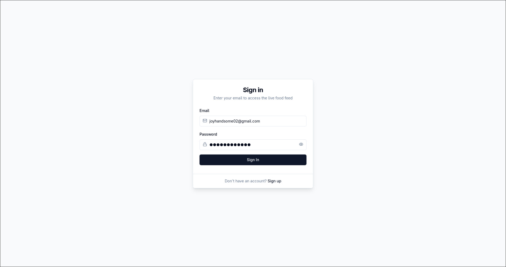
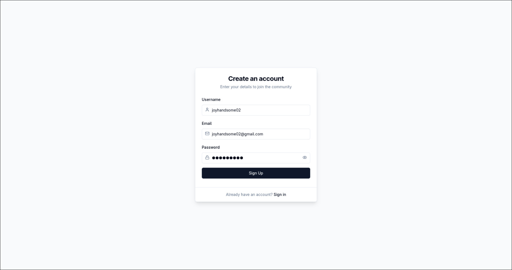
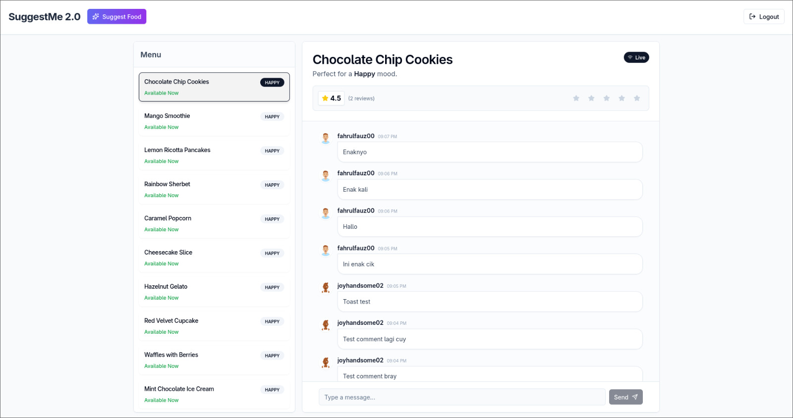
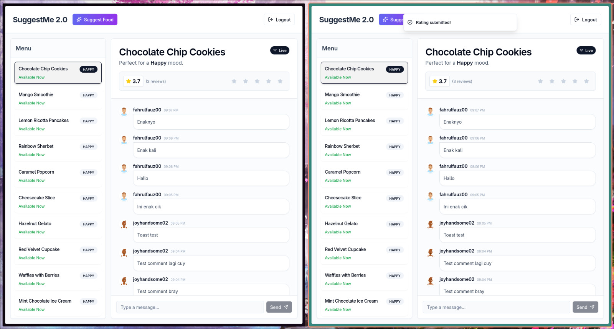
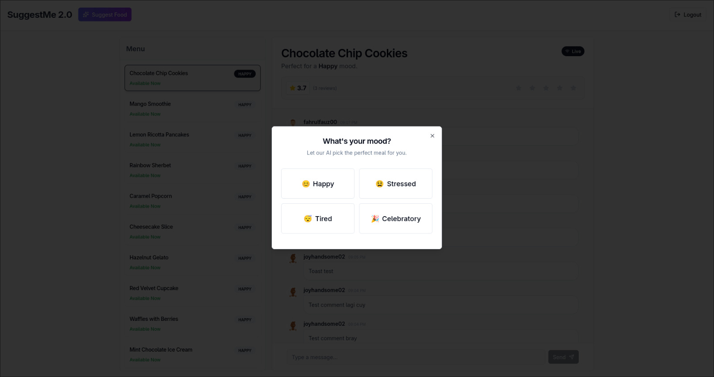
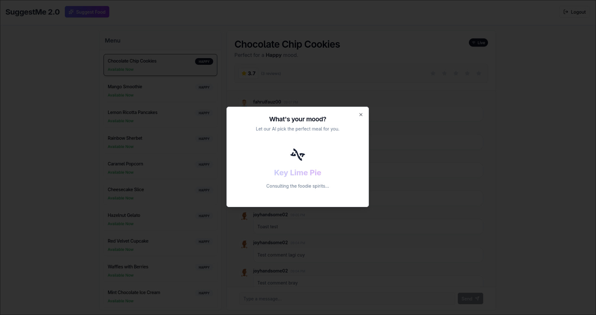
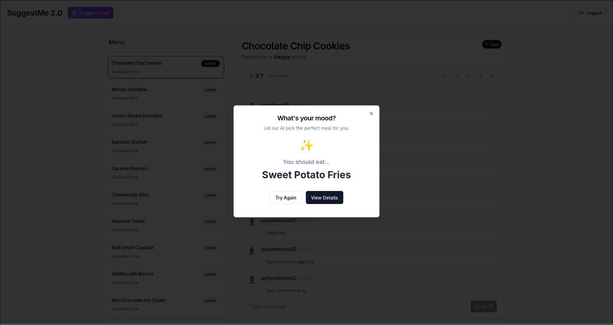

# SuggestMe 2.0 🍔

A real-time food suggestion application built with **React**, **Vite**, **TanStack Query**, and **WebSockets**.

**Depends on this project -> github.com/wiormiw/suggestme-2.0**

## ✨ Features

- **Real-time Updates**: Live comments and rating updates across all connected clients via WebSockets.
- **AI-Powered Suggestions**: "Food Lottery" feature suggests meals based on your mood using Generative AI.
- **Reactive UI**: Seamlessly handles online/offline states and socket reconnections.
- **Infinite Scroll**: Optimized performance with cursor-based pagination using TanStack Query.
- **Responsive Design**: Fully adaptive layout for Desktop, Tablet, and Mobile.

## 📸 Showcase

### Sign in/Sign up
| **Sign in View** | **Sign up View** |
|:---:|:---:|
|  |  |

### Main Page & Live Event Test
| **Main Page** | **Live Event Test** |
|:---:|:---:|
|  |  |

### Random AI Suggestion
| **Selection Based On Mood** | **Shuffling Suitable Food State** |
|:---:|:---:|
|  |  |

### After Suggestion


---

## 🛠️ Tech Stack

- **Frontend**: React, TypeScript, Tailwind CSS, Shadcn UI
- **State Management**: TanStack Query (Infinite Scroll & Caching)
- **Real-time**: Native WebSockets (Custom Hook with Auto-reconnect)
- **Build Tool**: Vite

## 🚀 Getting Started

1. **Clone the repository**
  ```bash
    git clone [https://github.com/your-username/suggestme-2.0-fe.git](https://github.com/your-username/suggestme-2.0-fe.git)
    cd suggestme-2.0-fe
  ```

2. **Install dependencies**
  ```bash
    pnpm install
  ```

3. **Configure Environment** Create a .env file in the root directory:
  ```bash
    VITE_API_URL=http://localhost:3000/api/v1
  ```

4.**Run the development server**
  ```bash
    pnpm dev
  ```